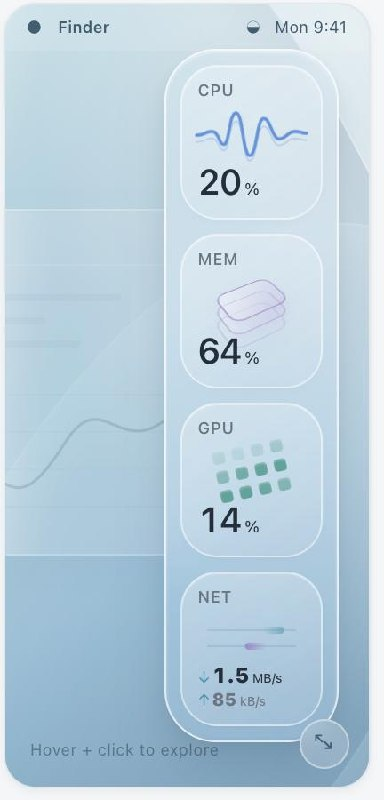

<div align="center">

# FloatDock

**Your Mac's vitals, in a dock that floats.**

A lightweight macOS menu-bar app that puts CPU, memory, GPU, and network activity
in a frosted-glass dock you can park anywhere on screen.

[](https://github.com/dedkola/FloatDock/actions/workflows/ci.yml)
[](https://www.apple.com/macos/)
[](https://swift.org)
[](LICENSE)



</div>

---

## Why another system monitor?

Most monitors are happy to lie to you a little. A reading fails, and the tile keeps
showing the last number as if nothing happened. A chart draws a point for a sample
that was never taken. You glance at it, trust it, and it's wrong.

FloatDock makes that impossible by design. Every metric carries its own validity
state, and the UI is forced to respect it:

```swift
public enum MetricReading<Value: Sendable & Equatable>: Sendable, Equatable {
    case warmingUp
    case available(Value, timestamp: Date)
    case stale(Value, timestamp: Date)
    case unavailable(String)
}
```

> Every provider keeps its own validity. A stale value is available to details,
> but must never masquerade as a current tile value or a new chart point.

So a metric that can't be read says *why* — "GPU activity isn't available on this
Mac", "Network counters are unavailable" — instead of quietly showing a zero. A
failed poll adds no chart point. A recent value may linger in a tile for up to three
seconds, and the UI checks that timestamp before choosing to show it.

The result is a dock you can actually trust at a glance.

## What it shows

| Tile | Reads | Source |
| --- | --- | --- |
| **CPU** | Busy, user, system, idle | `host_statistics` (`HOST_CPU_LOAD_INFO`) |
| **Memory** | Used, wired, compressed, swap | `host_statistics64` (`HOST_VM_INFO64`) + `vm.swapusage` |
| **GPU** | Utilization + device name | IOKit `IOAccelerator` performance statistics, Metal device name |
| **Network** | Up/down rate, session totals, active interface | `SystemConfiguration` + `NET_RT_IFLIST2` route table |

Network deliberately resolves the **physical** interface behind PPP/VPN layers, so
tunnel and outer traffic are never double-counted.

## Design notes

**One sampler owns every read.** A single actor and one cancellable scheduler drive
all metrics at 1 Hz. Nothing polls from SwiftUI, and no timer or subprocess is
created per metric. Delayed cycles start a fresh interval rather than catching up
with a burst of near-zero counter reads.

**It gets out of the way.** Sampling pauses when the dock is hidden and when the
system sleeps; it resumes on wake. It's a `LSUIElement` accessory app — menu bar
only, no Dock icon, no window clutter.

**The core is pure and tested.** `FloatDockCore` has no UI dependencies. Providers,
math, and history are unit-tested with [Swift Testing](https://developer.apple.com/xcode/swift-testing/).

## Requirements

- macOS 26.0 (Tahoe) or later
- Apple silicon
- Xcode 26 / macOS 26 SDK to build

## Build and run

```bash
git clone https://github.com/dedkola/FloatDock.git
cd FloatDock

./scripts/run.sh              # release build, then launch
./scripts/build.sh debug      # debug build only
./scripts/build.sh release --sandbox   # experimental sandboxed variant
```

`build.sh` compiles with SwiftPM, stages a signed `.app` bundle outside your
Documents folder, and ad-hoc signs it. Each build gets an immutable bundle path so
rebuilding never truncates a running executable.

## Tests

```bash
./scripts/test.sh             # all tests
./scripts/test.sh --filter MetricMathTests
```

Tests use Swift Testing with XCTest disabled. The build scratch path is cached per
checkout, so repeat runs are fast.

## Command-line probe

The app ships a headless diagnostic mode that prints JSON snapshots — handy for
verifying readings on a machine you can't look at:

```bash
./build/FloatDock.app/Contents/MacOS/FloatDock --probe 4
```

```json
{"cpu":{"busyPercent":12.4,"systemPercent":4.1,"userPercent":8.3},"gpu":{"name":"Apple M4 Pro","utilizationPercent":3},"memory":{"compressedBytes":1288490188,"totalBytes":25769803776,"usedBytes":13572096000},"network":{"interface":"en0","label":"Wi-Fi","receiveBytesPerSecond":18432,"sendBytesPerSecond":2048},"sample":0,"time":"…"}
```

Probes use their own sampler instance so baselines are never shared with the UI.

## Project layout

```
Sources/
  FloatDockCore/          # pure, UI-free, unit-tested
    CPUProvider.swift
    MemoryProvider.swift
    GPUProvider.swift
    NetworkProvider.swift
    MetricMath.swift
    MetricModels.swift     # MetricReading, values, SystemSnapshot
    MetricsSampler.swift   # the single actor + scheduler
    SegmentedHistory.swift
  FloatDockApp/            # SwiftUI + AppKit shell
    App.swift              # entry point, menu bar, lifecycle
    DockWindowController.swift
    DockViews.swift
    DockSurfaceView.swift
    CurrentMetricGlyph.swift
    HistoryChart.swift
    AppearanceSettings.swift
    SettingsViews.swift
Tests/
  FloatDockCoreTests/
Config/                    # Info.plist + entitlements (normal & sandbox)
scripts/                   # build / run / test / toolchain / sandbox probe
```

## Status

Early. `0.1.0` — the sampling core is settled and tested; the UI is still moving.
Not yet notarised or distributed as a binary.

## Contributing

Issues and pull requests are welcome — see [CONTRIBUTING.md](CONTRIBUTING.md).
Please read [SECURITY.md](SECURITY.md) before reporting anything sensitive.

## License

[MIT](LICENSE).
